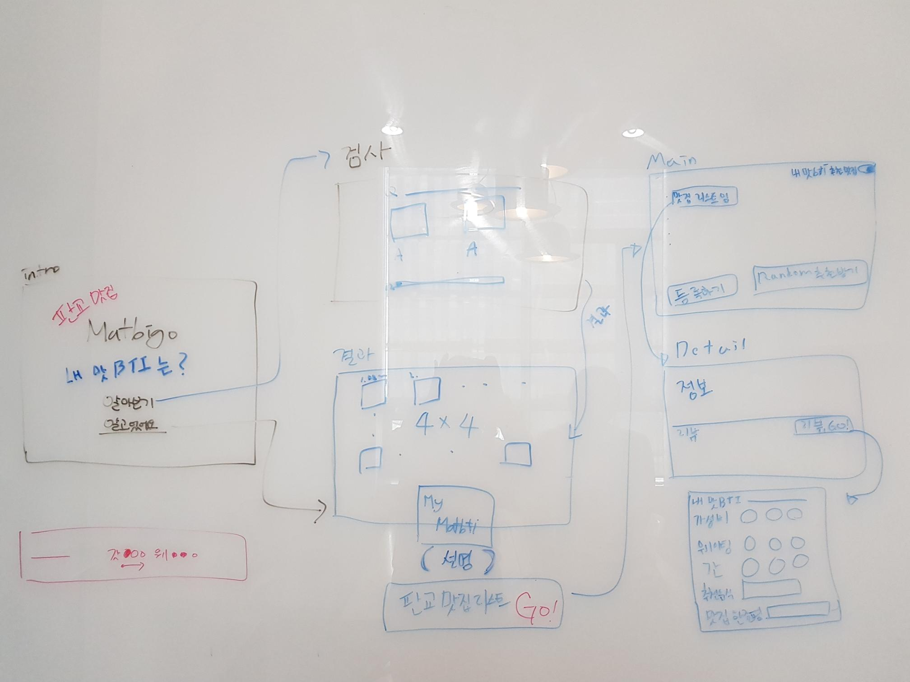
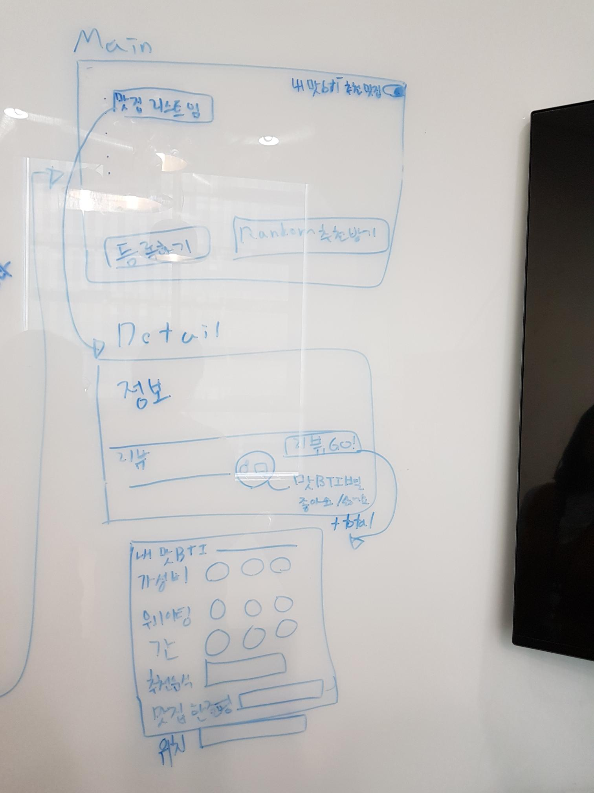
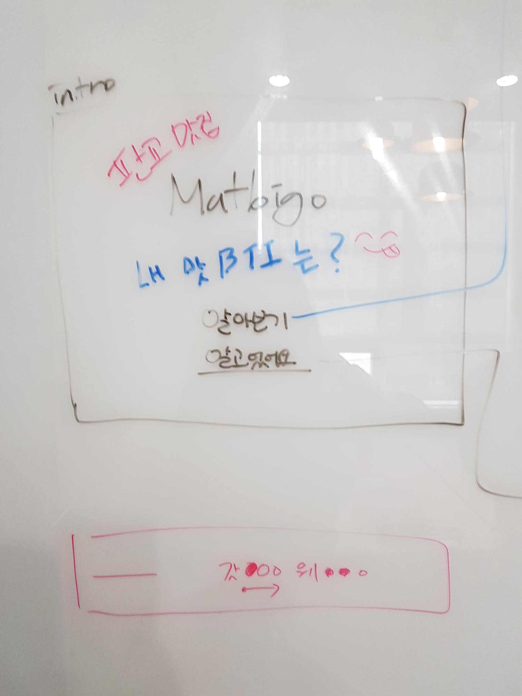

## 아이디어 회의 2 (2021-02-08)
와이어프레임 기획

## 회의 사진

## intro page

* Matbigo, 플젝 소개 등의 내용
* 사용자가 MatBTI 를 알고 있을 경우
  * 알고있어요 -> MatBTI 설명 page
* 사용자가 MatBTI 를 모를 경우
  * 알아보기 -> MatBTI 검사 page
  

## MatBTI 검사 page
* 12 질문 Progressbar
* 질문(상황), 응답(음식 이미지, 음식 이름)
  
## MatBTI 결과 page
* MatBTI 유형값이 있을 경우
  * MatBTI 검사 page로 부터 넘어온 결과 값이 있을 경우
  * 리스트에서 유형을 클릭한 경우
    * 내 유형 설명 contents
    * Main 화면 진입 Button

## Main 화면
* 맛집 리스트 (아이템 클릭시 detail 진입)
* 내 MatBTI 별 맛집 리스트 필터링 버튼
* 등록하기 / Random 추천 받기 

## Detail 
* 맛집에 대한 정보
* 리뷰 목록
* 리뷰 등록 버튼 (리뷰 페이지 진입)
* 리뷰에 대한 도움 됐어요/ 나랑 입맛이 달라요?

## 리뷰 등록 
* 각 항목마다 3단계 중 택 1
* 내 맛BTI
* 가성비
* 웨이팅
* 간
* input
  * 추천음식
  * 한줄평 (추천사)